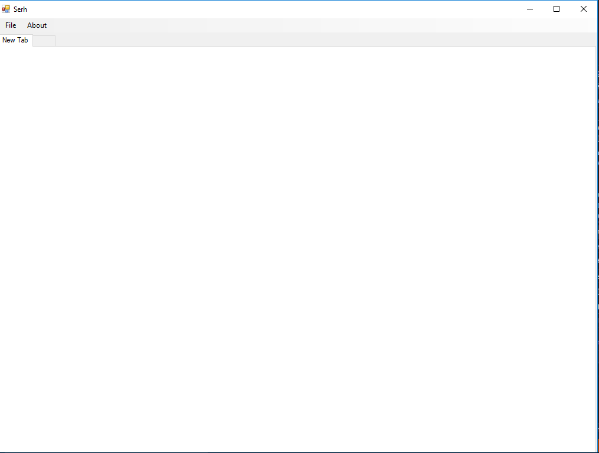
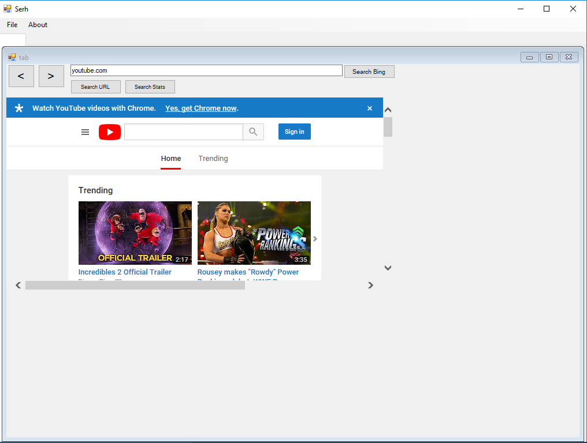

<link href="style.css" rel="stylesheet" />
<link href="https://fonts.googleapis.com/css?family=Raleway" rel="stylesheet" />

  

    <h1>
      Serh
    </h1>
    <h2>
      The free, open source search engine.
    </h2>
     
    <a href="https://github.com/MatthyPlayz/Serh/archive/master.zip">
      
      Download Serh Direct
    </a>
  

<h3>Simplistic</h3>

The tabbed, regular UI you love.

<h3>Example Photos</h3>

<h3>Open Source</h3>

The software is for download right <a href="https://drive.google.com/uc?export=download&id=1tMQTWV6w-5bQSI0ZOWih5ICprPXLBnrM">here</a>.

Nothing left :(

